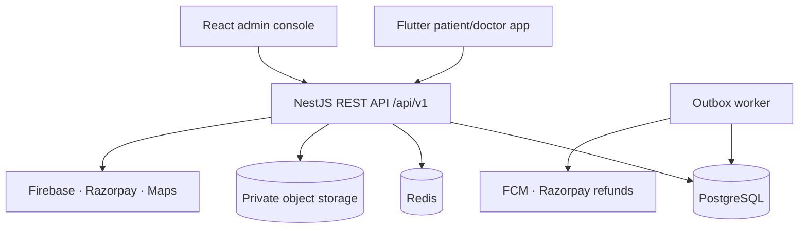
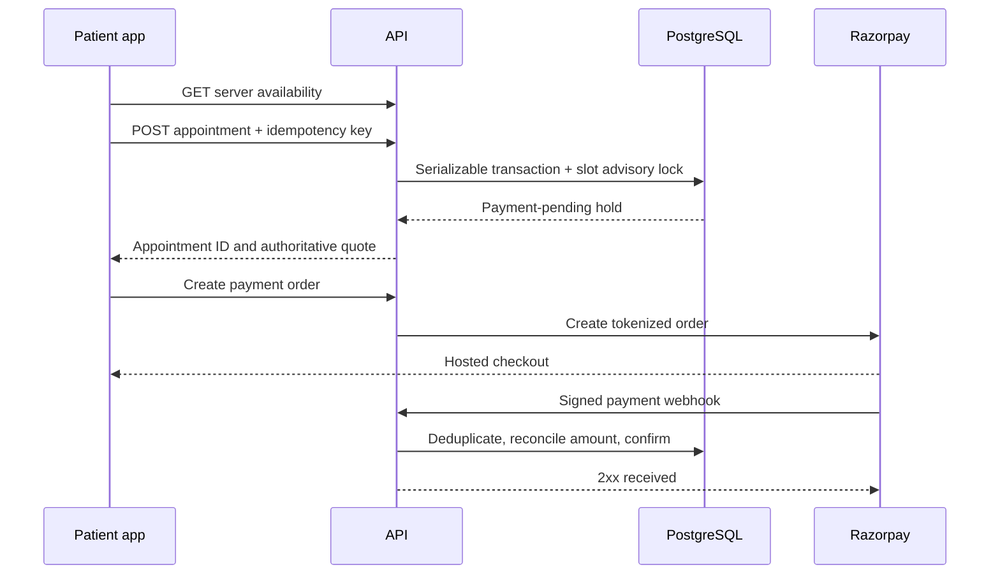

# Architecture

## Runtime topology

The API is stateless and can scale horizontally. PostgreSQL is authoritative for doctors, schedules, appointments and money. Redis is reserved for short-lived caching, rate-limit state and distributed job coordination; it must never become the only source of appointment truth. Private object storage holds encrypted verification bytes while PostgreSQL holds checksums and metadata. The worker consumes topic-owned transactional outbox rows so notifications and idempotent refunds are retried without coupling them to HTTP response time.

## Modules

| Module | Responsibility | Trust boundary |
| --- | --- | --- |
| Auth | Firebase OTP token verification and short-lived CareBook JWT | Firebase proves phone ownership; CareBook decides role |
| Doctors | Onboarding, verification state, search, profile, schedules and slots | Public reads return only approved profiles |
| Appointments | Holds, capacity, history, cancellation and completion states | Availability and fees are server-calculated |
| Payments | Razorpay orders, raw webhooks, reconciliation and refund events | Webhook signature and amount must both match |
| Notifications | Durable in-app reminders and outbox processing | No appointment secrets in push previews |
| Admin | Verification, commission, analytics and audit actions | Pre-provisioned ADMIN role only |

## Booking sequence

If the webhook arrives after a hold expired or an appointment was cancelled, payment is recorded but the appointment is not silently revived. A `refund.required` outbox event is created for the refund worker/operations queue.

## Evolution path

Future modules—video consultation, prescriptions, records, labs, medicines and family profiles—should be separate bounded contexts. Never append medical-record access to the appointment search read model. Use explicit consent, scoped access grants, separate retention rules and tamper-evident audit trails before adding clinical data.
