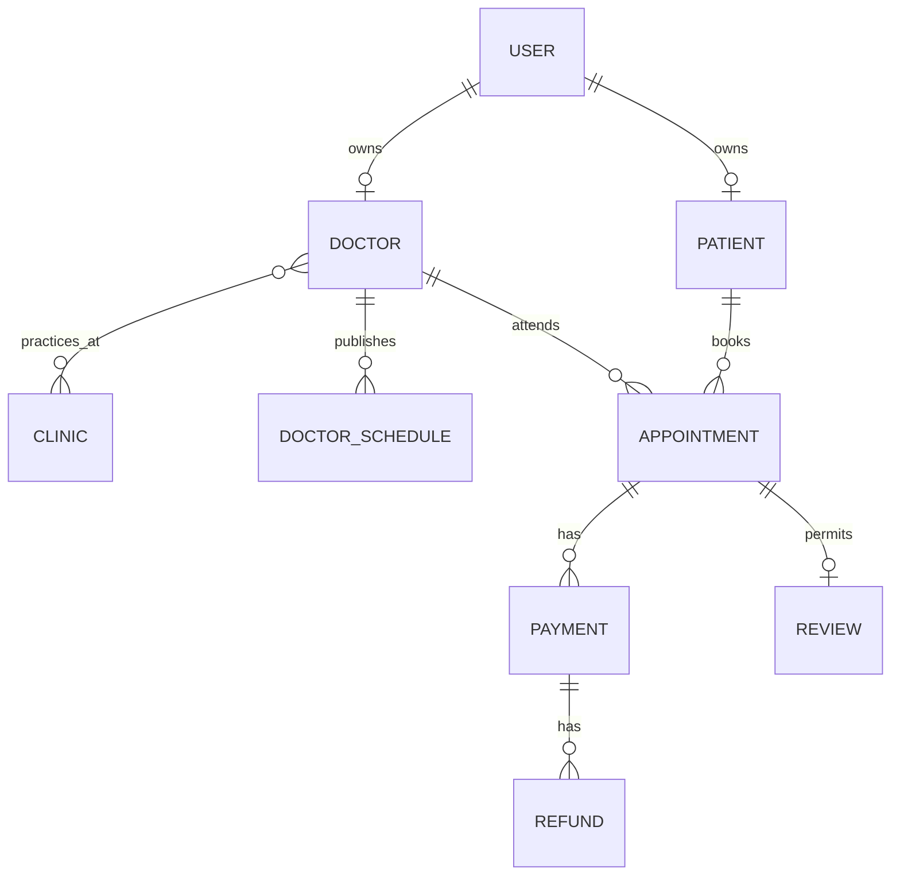

# Database design

PostgreSQL is the source of truth. The Prisma model is `apps/api/prisma/schema.prisma`; `0001_init/migration.sql` is the baseline migration.

## Relationship map

Important details:

- UUIDs are internal identifiers; `CB-YYYY-NNNNNN` is the support-friendly public appointment ID.
- Money is stored in integer paise.
- Timestamps are `timestamptz`; the product displays `Asia/Kolkata` initially.
- Doctor public search is gated by `DoctorStatus.APPROVED`.
- `appointment_status_history`, `payments`, `refunds` and `audit_logs` are append-oriented evidence tables.
- `payment_webhook_events(provider,event_id)` prevents duplicate processing.
- `outbox_events` couples domain mutation and future side effects in one transaction.
- `patient_id + idempotency_key` prevents duplicate booking retries.
- `appointment_status_history.request_key` makes rescheduling retries idempotent.
- Doctor document rows store only private object keys, checksums and verified upload metadata; file bytes remain outside PostgreSQL.
- A PostgreSQL advisory lock on `doctor + startAt`, followed by a capacity count inside a serializable transaction, prevents concurrent overbooking while supporting `maxAppointmentsPerSlot > 1`.

## Indexing

The baseline includes doctor status/rating, schedule lookup, doctor-slot appointment lookup, patient timeline, payment state, notification delivery and trigram name/clinic indexes. Before expanding beyond Delhi-NCR, run `EXPLAIN (ANALYZE, BUFFERS)` against real search patterns and add a proper geo index (PostGIS is recommended) instead of sorting large sets in application memory.

## Backups and retention

Use encrypted automated backups, point-in-time recovery, separate restore credentials and quarterly restore drills. Define legal retention periods before launch. Do not keep rejected identity documents forever; store document bytes in private object storage, not PostgreSQL, and keep only opaque storage keys/checksums here.
